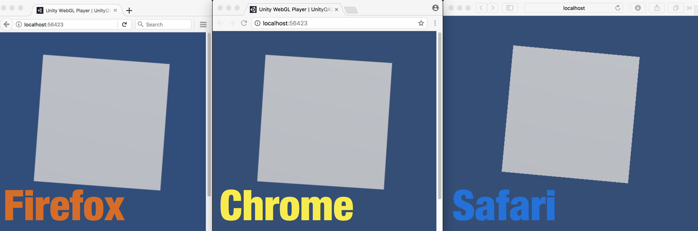
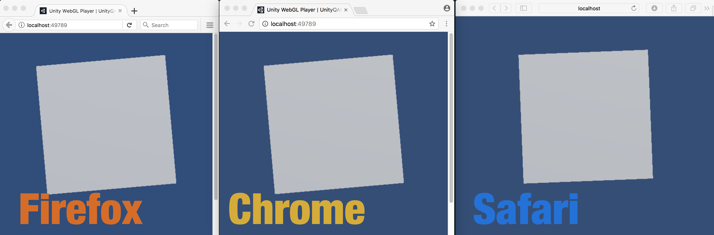
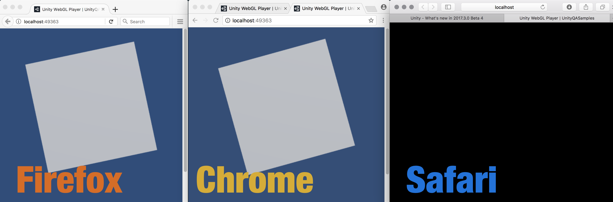
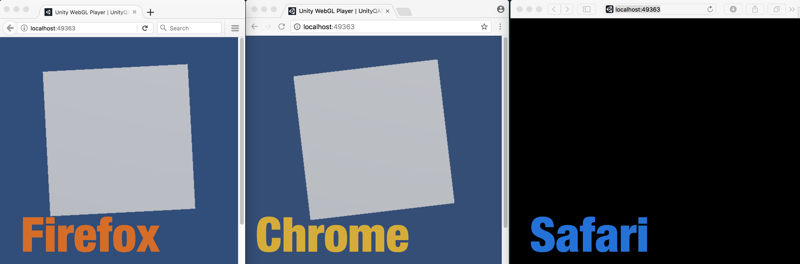
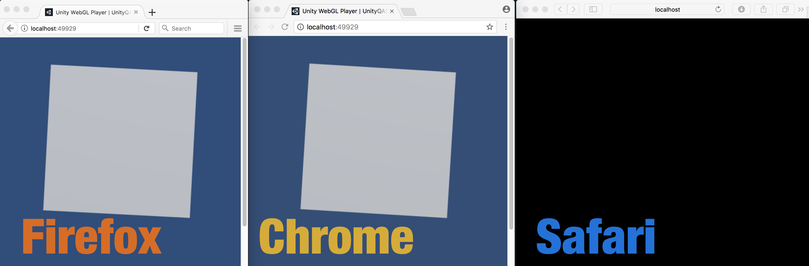
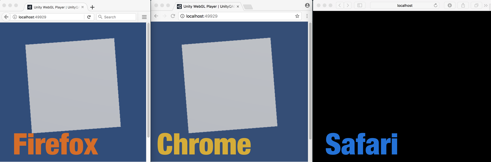

## 1. WebGLAA

This sample demonstrates an issue with anti-aliasing on WebGL builds. The main camera uses the **forward rendering** pipeline and AA is set to **8x**.

Here are the results for different combinations of:   

- Unity version
- Browser
- WebGL API

## Unity 2017.2.0f3 (macOS 10.12.6)

*Unity 2017.2.0f3 build (auto Graphics API)*

*Unity 2017.2.0f3 build (WebGL 1.0)*

Browser | WebGL 1.0 | WebGL 2.0 or WebGL 1.0
--- | --- | --- 
Firefox | no AA |  okay
Chrome |  no AA | okay
Safari | no AA | fallback to WebGL 1.0, no AA
  
## Unity 2017.3.0b4 (macOS 10.12.6)
 

*Unity 2017.3.0b4 build (auto Graphics API)*

*Unity 2017.3.0b4 build (WebGL 1.0)*

Browser  | WebGL 1.0 | WebGL 2.0 or WebGL 1.0
--- | --- | --- 
Firefox | no AA | okay
Chrome |  no AA | okay
Safari | black screen | black screen

## Unity 2017.3.0b7 (macOS 10.12.6)

*Unity 2017.3.0b7 build (auto Graphics API)*

*Unity 2017.3.0b7 build (WebGL 1.0)*

Browser  | WebGL 1.0 | WebGL 2.0 or WebGL 1.0
--- | --- | --- 
Firefox | no AA | okay
Chrome |  no AA | okay
Safari | black screen | black screen